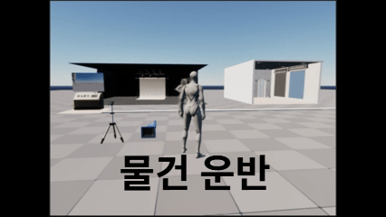

Rail Camera Studio

- 상속 구조 기반의 Interaction Framework 설계
    - 상호작용 가능한 모든 객체의 공통 로직과 네트워크 동기화 변수를 포함하는 Base Interaction Actor 클래스를 설계하여 코드 중복을 최소화.
    - 새로운 상호작용 물체를 추가할 때, 기본 로직(Highlight, Input Handling 등)을 재작성할 필요 없이 Virtual Function(가상 함수) 오버라이딩만으로 고유 동작을 구현할 수 있도록 생산성 극대화.
    - 상태값(State) 및 상호작용 관련 변수를 부모 클래스 수준에서 관리하여, 데이터 일관성을 유지하고 네트워크 리플리케이션(Replication) 설정의 효율성 확보.
- 네트워크 동기화 아키텍처
    - Replication 및 RPC(Remote Procedure Call)를 활용하여 서버-클라이언트 간의 오브젝트 상태를 실시간 동기화.
    - 서버 권한(Authority) 기반의 상호작용 판정 로직을 통해 다중 사용자 환경에서의 데이터 무결성 보장.
- 객체지향 설계 및 캡슐화
    - 상호작용 로직을 모듈화하여 기능 단위로 캡슐화함으로써, 프로젝트 규모 확장 시에도 안정적인 유지보수가 가능한 구조 구축.

